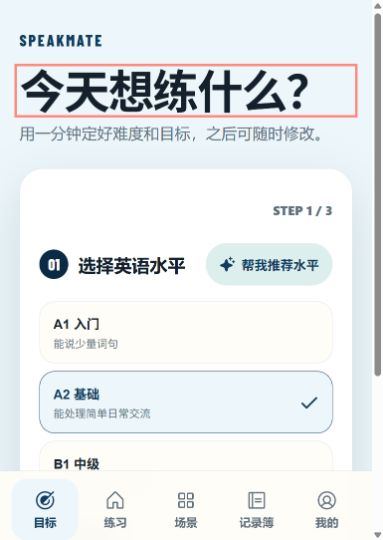
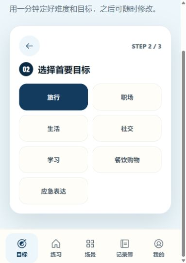
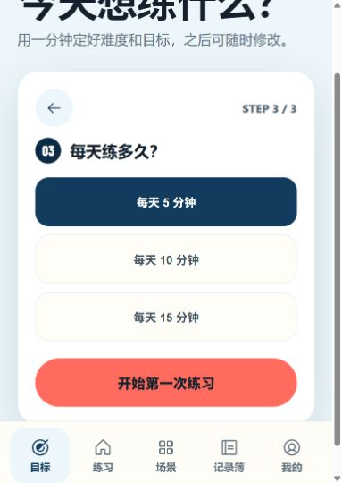
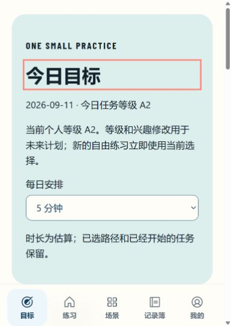

# 修复后本地页面观察（五步局部观察）

日期：2026-09-11；代码提交 `159d782`，构建 `84VSxAjpcpoWNjMlYmx1D`。独立限定复审随后确认来源传递及历史按需读取通过，但导航尚有异步时序和普通草稿保护释放问题，第二轮修复已开始。以下观察不证明这些问题已修复，3.0 未发布。

工具：Codex 内置浏览器；独立本地地址 `http://127.0.0.1:3127`，仅合成测试资料。不是正式站点或旧 3114 服务的数据。实际窗口 `innerWidth=395`、`innerHeight=556`、内容宽度 383px；未开启精确手机模拟或断网。截图保存后逐张重新打开核对，未编辑图像。

|步骤|观察|证据与限制|
|---|---|---|
|1. 欢迎页|指定完整标题短语、“开始练习”和补充文案可见；五项导航顺序正确，无横向溢出。五项触摸框约 68.6×63.5px。|01-welcome.png；错误／警告日志为空，未见框架错误覆盖层。仅当前窗口，标题焦点轮廓可见，不代表 320px 或 200% 文字通过。|
|2. 进入等级引导|点击实际开始链接，加载后显示三级引导的水平选择；A1–C1 可发现，当前默认 A2。|02-level.png；页面可垂直滚动，完整后续流程尚未核对。|
|3. 选择 A2 后进入兴趣|实际点击 A2 后出现七项兴趣与返回水平按钮；当前视口中选项及底栏没有横向铺开。|03-interest.png；尚未用键盘或辅助技术验证焦点顺序。|
|4. 选择旅行后进入时长|5／10／15 分钟及开始按钮实际可见，提供返回兴趣按钮。当前保持默认 5 分钟。|04-duration.png；当前滚动位置下主按钮未被底栏遮挡，尚未验证 200% 文字和软键盘。|
|5. 保存后进入今日目标|真实保存 A2／旅行／5 分钟，回到 `/` 的今日目标；DOM 有三项未开始核心任务、0 积分及未打卡日历，无控制台错误／警告。内容宽 383px，无横向溢出。|05-goal-home.png；没有开始或完成学习任务。当前 556px 高窗口首屏主要是设置说明卡，任务需向下滚动；这是信息密度的后续 UX 检查点，不等于被底栏遮挡。|

本记录只接受本次新截图与实际操作作为证据。后续步骤、真正离线、原生系统权限、实体 iPhone、VoiceOver 和中国大陆各运营商均未验收。没有完成学习任务、操作麦克风或清理站点数据；只在独立本地地址保存了合成的引导设置和今日计划。测试服务已停止，测试页签已关闭，不把临时地址当作部署或可用交付链接。

## 已核对的原始截图

### 1. 欢迎页：当前窗口正常

### 2. 等级引导：入口正常

### 3. 兴趣：七项选择可见

### 4. 时长：主按钮未被底栏遮挡

### 5. 今日目标：保存成功，首屏密度待后续审查

